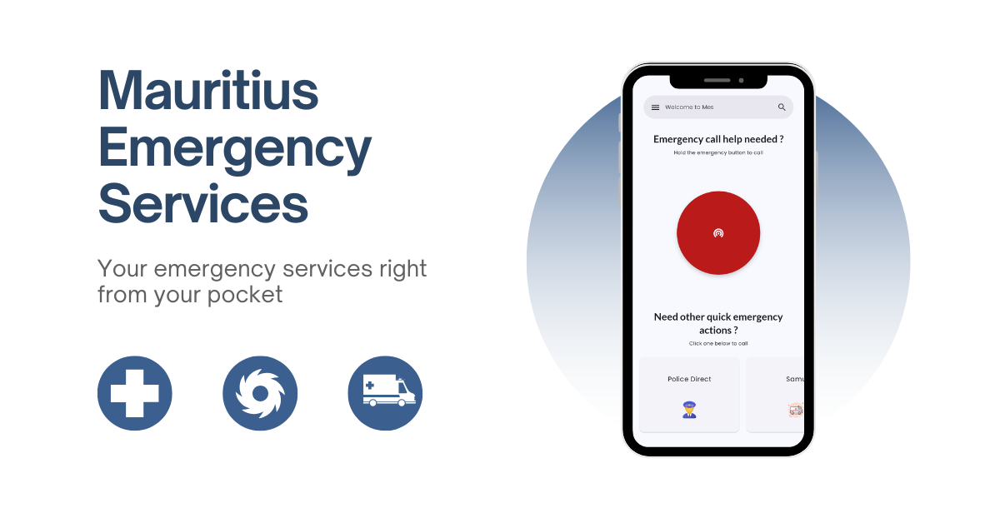
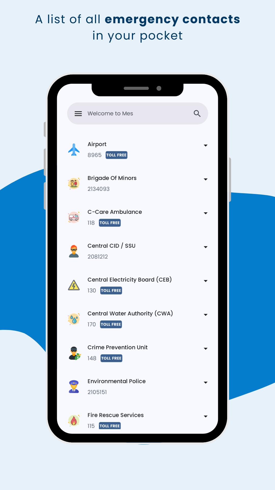
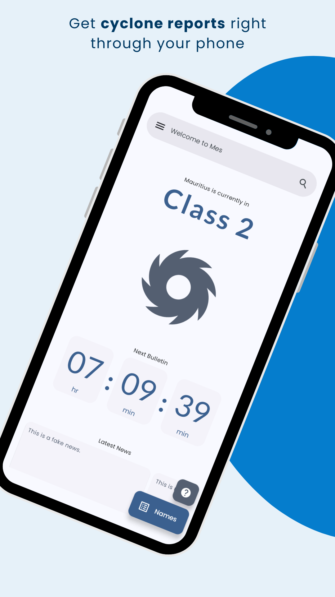
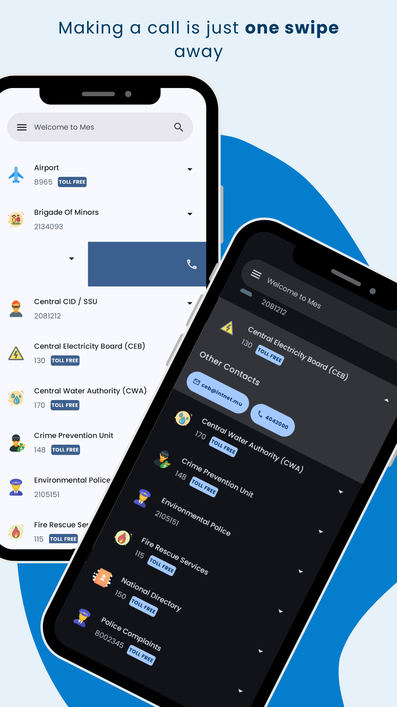
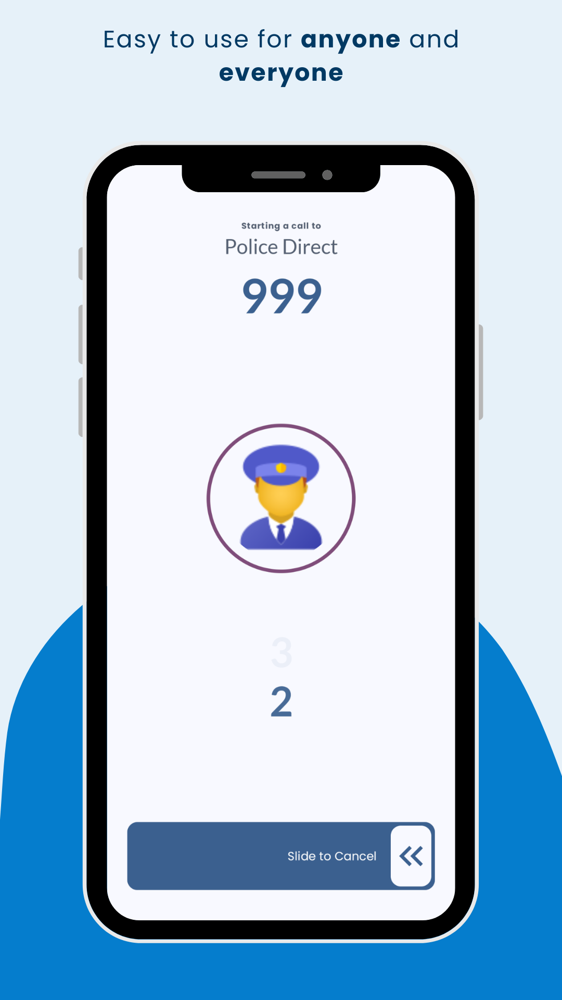
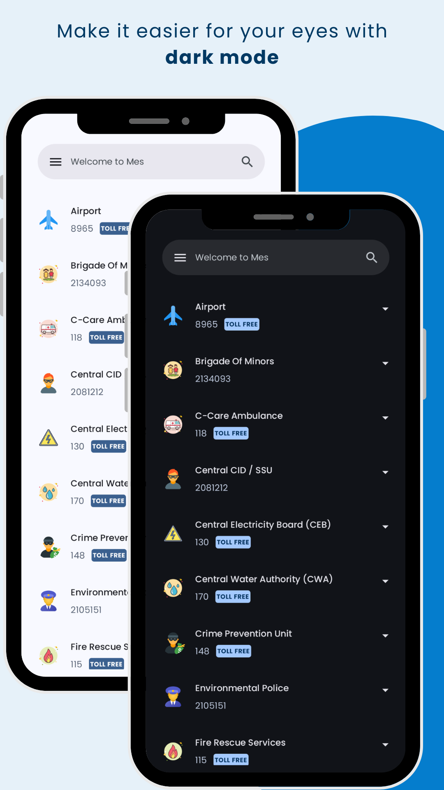
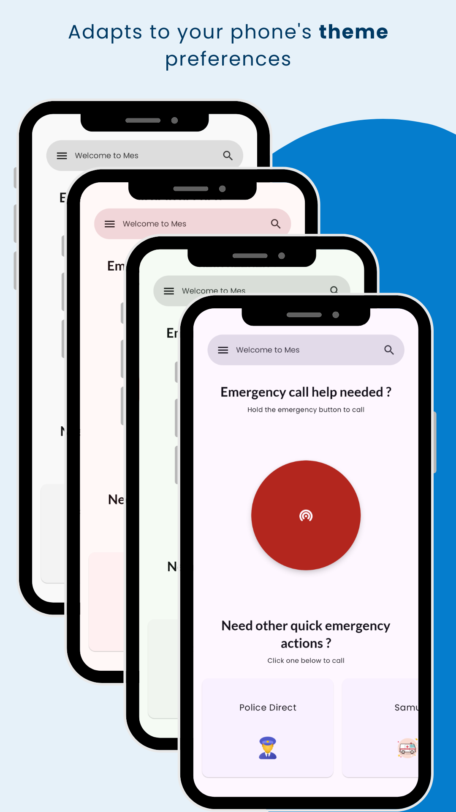

# Mauritius Emergency Services (Mes)



## Table of Contents

- [Introduction](#intro)
- [Official Website](#official_website)
- [Screenshots](#screenshots)
- [Support](#support)
- [Donations](#donations)
- [License](#license)

`<a href="intro"></a>`

## Introduction

This is the official Github Repo of [Mauritius Emergency Services (MES)](https://play.google.com/store/apps/details?id=com.th3pl4gu3.mauritius_emergency_services), an emergency calling services app for Mauritius.

Mes is a cross-platform local app developed by a citizen of Mauritius to help other people call the right number at the right time, anywhere on the island.
Mes also includes other services contact that could be helpful in certain situations.
It has been designed using the guidelines of Material Design and has been adapted to the new Material You by Android.

`<a href="official_website"></a>`

## Official Website

Mes can be found on its [official website](https://mes.plagueworks.org/web) or via the [playstore](https://play.google.com/store/apps/details?id=com.th3pl4gu3.mauritius_emergency_services)

`<a href="screenshots"></a>`

## Screenshots

    
 

`<a href="support"></a>`

## Support

Reach out to us at the following:

* Website: [mes.plagueworks.org](https://mes.plagueworks.org/web)
* Play Store: [Mes](https://play.google.com/store/apps/details?id=com.th3pl4gu3.mauritius_emergency_services)
* Support Email: th3pl4gu33@gmail.com

`<a href="donation"></a>`

## Donations

If you love this project, you can donate in-app or also by Liberapay:

`<noscript><a href="https://liberapay.com/th3pl4gu3/donate">``</a>``</noscript>`

`<sub>`Badge`</sub>`


`<a href="license"></a>`

## License

```
Copyright Mervin Hemaraju
```
